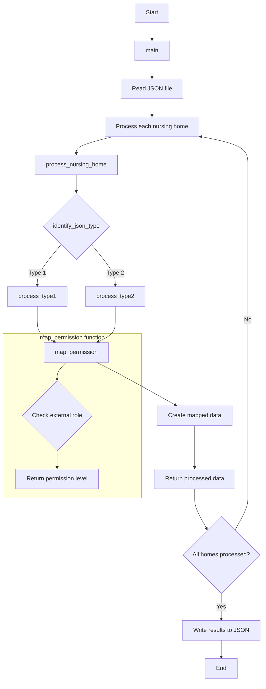

```mermaid
flowchart TD
    A[Start] --> B[main]
    B --> C[Read JSON file]
    C --> D[Process each nursing home]
    D --> E[process_nursing_home]
    E --> F{identify_json_type}
    F --> |Type 1| G[process_type1]
    F --> |Type 2| H[process_type2]
    G --> J[map_permission]
    H --> J
    J --> K[Create mapped data]
    K --> L[Return processed data]
    L --> M{All homes processed?}
    M --> |No| D
    M --> |Yes| N[Write results to JSON]
    N --> O[End]
    
    subgraph "map_permission function"
    J --> P{Check external role}
    P --> Q[Return permission level]
    end
```
