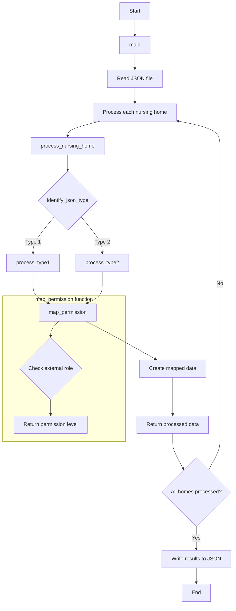

This is my documentation:

Note: in the project I maked the assumption that the roles where standardized. If they are not standardized i just tag them or gave them the level 0. if this is not the case i could have added a role mapping function with variations from the role name

First the Json is read.
The elements are read and classify if they are from 1 from the 2 types. (there could be more, in that case i just pass the "unknown structure" message)
Then those dicts are classified into type 1 or type 2. 
The "bezeichnung" or "qualifikation" is read and mapped with the dict of roles and levels.
Then the new list is created with dicts inside
The lists are saved and written in a new Json file

